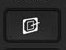

## Lock Key

There is no specific key for locking your desktop. But you can use key

which is `Super+D`. You can configure it by:

1. Go to _Settings -> Devices -> Keyboard_
2. Create new shortcut with desired function, e.g.: `xte 'keydown Alt_L' 'key Tab' 'keyup Alt_L'`

