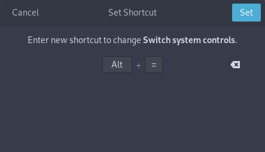

- [Arch Linux Wiki](https://wiki.archlinux.org/index.php/Logitech_MX_Master)

| Physical action              | detected as           |
|------------------------------|-----------------------|
| Left button                  | button 1              |
| Press to wheel               | button 2              |
| Right button                 | button 3              |
| Scroll wheel up              | button 4              |
| Scroll wheel down            | button 5              |
| Press "i" button under wheel | undetectable in linux |
| Scroll hor_wheel right (up)  | button 6              |
| Scroll hor_wheel left (down) | button 7              |
| Side-bottom button           | button 8              |
| Side-top button              | button 9              |
| Thumb button                 | Ctrl+Alt+Tab          |

## Thumb wheel

- Install `xbindkey` and `xautomation`.
- Create file for autostart `~/.config/autostart/xbindkeys.desktop`:

		[Desktop Entry]
		Type=Application
		Name=xbindkeys
		TryExec=xbindkeys
		Exec=xbindkeys
		Icon=xbindkeys

### Volume Control
Create file `~/.xbindkeysrc` with content:

	# thumb wheel up => increase volume
	"xte 'key XF86AudioRaiseVolume'"
		b:6

	# thumb wheel down => lower volume
	"xte 'key XF86AudioLowerVolume'"
		b:7

### Switch between tabs
Create file `~/.xbindkeysrc` with content:

	# thumb wheel up => prev tab
	"xte 'keydown Control_L' 'key Page_Up' 'keyup Control_L'"
		b:6

	# thumb wheel down => next tab
	"xte 'keydown Control_L' 'key Page_Down' 'keyup Control_L'"
		b:7

### Disable Touchpad Horizontal Scrolling

Check files `/usr/share/X11/xorg.conf.d/??-libinput.conf` (?? is usually 40 or 90) and make sure it looks like this:

	Section "InputClass"
		Identifier "libinput touchpad catchall"
		MatchIsTouchpad "on"
		MatchDevicePath "/dev/input/event*"
		Driver "libinput"
		Option "HorizontalScrolling" "False"
	EndSection

If you have a TrackPoint, you can also disable it in section `Identifier "libinput pointer catchall"` but it needs to be enabled at least on one place otherwise the signal is completely masked (based on my experience).

## Thumb button

It raise `CTRL+ALT+TAB`. So it's more complicated. But you can configure it for different purposes.

First you need to disable standard `CTRL+ALT+TAB` behaviour.

1. Go to _Settings -> Devices -> Keyboard_
2. Change the old function for `CTRL+ALT+TAB` - it's _Switch system controls_ by default, I changed it to something which you don't use, e.g.: `ALT+=` 

### Play/Pause Music

1. Go to _Settings -> Devices -> Keyboard_
2. Crete a new shortcut - you can press the thumb button to catch it exactly. And configure it for `xte 'key XF86AudioPlay'` to play or pause my music. 

### Window Switch

1. Go to _Settings -> Devices -> Keyboard_
2. Crete a new shortcut - you can press the thumb button to catch it exactly. And configure it for `xte 'keydown Alt_L' 'key Tab' 'keyup Alt_L'` to switch between two recent windows.
